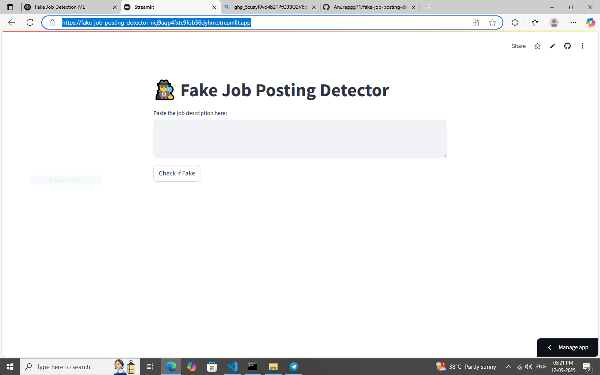

# 🕵️‍♂️ Fake Job Posting Detection

This project uses machine learning to detect fake job postings based on a dataset of real and fraudulent listings.

🚀 **Live Demo**: [Click here to run the app](https://fake-job-posting-detector-ncj9aqp4fxtc9fob56dyhm.streamlit.app/)

## 📌 Features
- Input job title, description, and location to predict authenticity
- ML model trained using scikit-learn
- Deployed with Streamlit Cloud

## 📁 Dataset
The dataset used is from Kaggle: [Fake Job Postings Dataset](https://www.kaggle.com/shivamb/real-or-fake-fake-jobposting)

## 🧠 Tech Stack
- Python
- Streamlit
- Scikit-learn
- Pandas
- Joblib

## 📸 Screenshot
  <!-- optional if you add a screenshot -->

## 📄 License
MIT License
